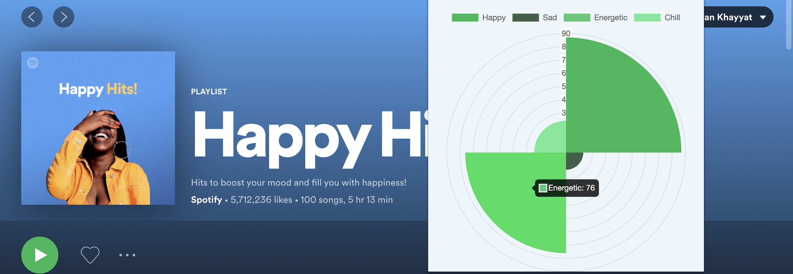

# Spotify Mood Predictor
_A Chrome extension that predicts the vibe of your playlists!_


SMP is a Google Chrome extension that has an integrated MLP model in the backend to fit your Spotify playlist songs and predict their overall mood. Current classes predicted are 'Happy, Sad, Chill, Energetic'.

- Communicates with a Python HTTP Server that activates a predict function locally.
- Uses Chart.js on the frontend to beautifully display the data.
- Only works on Spotify websites.

This is just a small student project that grew from my Machine Learning class, my team and I collected, labelled, and quality-checked music data through the Spotify track features API, which is then fed to an optimized backpropogation model. It achieves 89% testing accuracy for Happy/Sad classifications and 79% for Chill/Energetic. Testing accuracy was measured on a 10-fold cross validation. I personally went on and developed this chrome extension for everyone to see.

This is my first time developing a chrome extension so I would appreciate any feedback. I have yet to submit this project to the Google play store but go ahead and clone this repo to enjoy it yourself!

## Installation
I had a lot of trouble trying to import frontend packages through CDN since the extension wouldn't accept them for some reason, so I embarassingly downloaded the package files and used them locally. I also used a conda envirounment for the Python server and model. Here's how you can run this extension on your machine:

Clone this repository

```sh
git clone https://github.com/AdnanKhayyat1/SpotifyMood.git
cd SpotifyMood
```

I gitignored ```server/constants.py``` which contains Spotify authentication credentials. You need to generate those yourself. It also contained server host address and port number. Create the  ```server/constants.py``` file and add the following four constants:
```
CLIENT_ID = <string>
CLIENT_SECRET = <string>
hostName = 'localhost'
serverPort = 8080
```
Activate a Conda virtual envirounment and install all the packages from ```package-list.txt``` file. 
You should be all set up for the backend.

To load the chrome extension use [this tutorial here.](https://developer.chrome.com/docs/extensions/mv3/getstarted/).
(Side note: since the model runs on a local server you really don't need a front-end interface. Do```GET http://localhost:8080/pl/<playlist_id>``` to get happy,sad,energetic,chill moods in a JSON object.)

